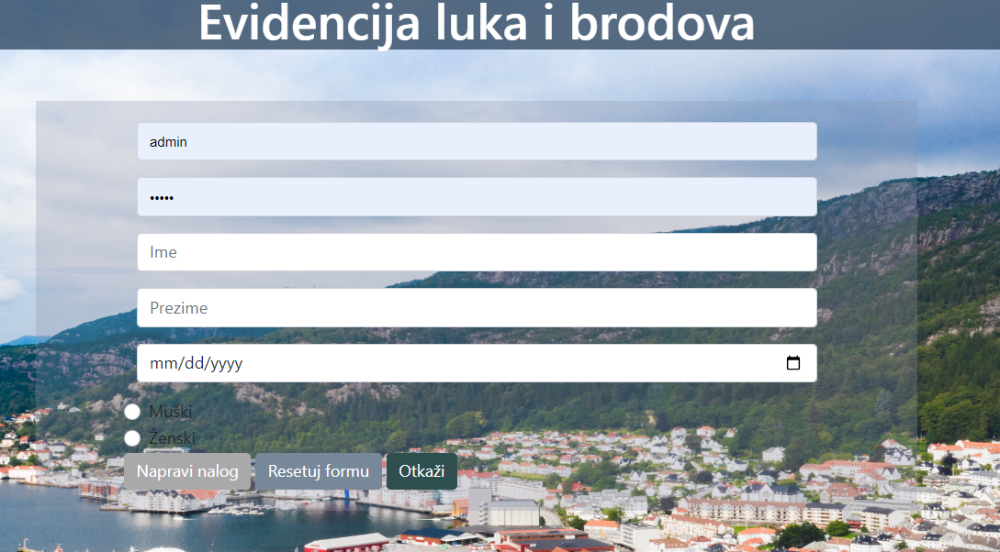
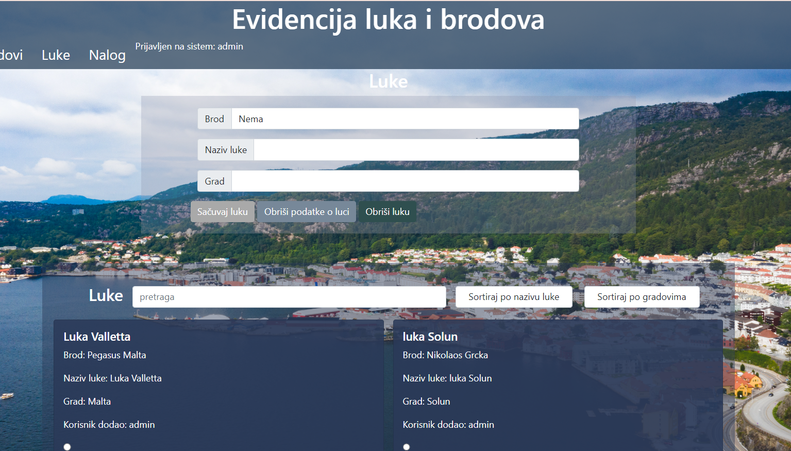
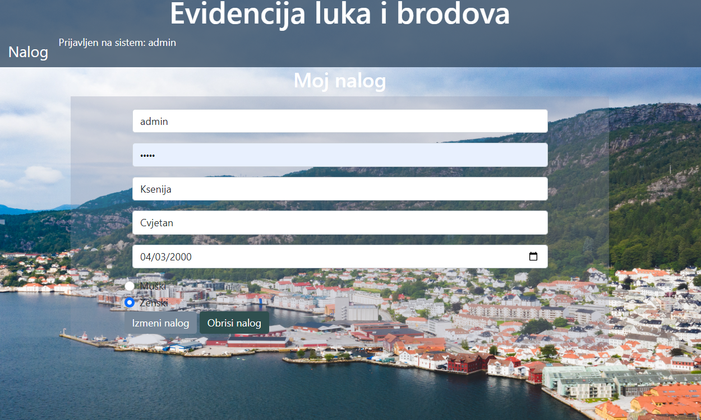

# Port and Ship Management System

The Port and Ship Management System is a comprehensive application aimed at facilitating the efficient management of maritime assets, including ships and ports. This system provides users with a robust set of features for organizing, monitoring, and maintaining crucial information related to maritime operations.

## Overview:

The Port and Ship Management System offers a suite of functionalities tailored to the specific needs of maritime administrators, operators, and stakeholders. Key features include:

- **User Authentication**: The system provides secure login functionality for authorized users, ensuring access control and data privacy.
  
- **Registration Interface**: Users can easily register new accounts, enabling them to utilize the system's features and capabilities.

- **Homepage**: The homepage serves as the central hub for users, offering intuitive navigation to key sections of the application, such as ship management, port management, and account settings.

- **Port Management**: Users can efficiently manage port-related information, including port names, locations, and key attributes. The system supports operations such as port creation, deletion, modification, and search.

- **Ship Management**: Users have the ability to manage ship data, including ship names, origins, types (e.g., passenger, cargo), and other relevant details. Ship management functionalities encompass creation, deletion, modification, and search capabilities.

- **Account Management**: Users can update and manage their account information, ensuring accuracy and relevance of user profiles within the system.

## Project Structure:

The project structure is organized into logical components to facilitate ease of development, maintenance, and scalability:

- **Handlers**: Contains modules responsible for implementing CRUD (Create, Read, Update, Delete) operations for ships, ports, and accounts.

- **Models**: Defines data models and structures representing ships, ports, accounts, and other entities within the system.

- **Pages**: Contains PHP files representing different user-facing pages, including the homepage, registration page, port management page, ship management page, and account management page.

- **CSS**: Includes cascading style sheets (CSS) for styling and theming the user interface components, ensuring a cohesive and visually appealing user experience.

- **JS**: Implements JavaScript functionality for enhancing user interactions and responsiveness across various device form factors.

## Getting Started:

To deploy and run the Port and Ship Management System locally, follow these steps:

1. Clone the project repository to your local machine.
2. Create a database using PHPMyAdmin, and name it as the database made in this project, and then import the database.
3. Ensure that PHP is properly configured on your web server.
5. Access the application through your web server's URL and navigate to the desired functionality (localhost:8080/..).

## Screenshots of the application:
### Login page

  

### Register
- If a user doesnt't have an account, there is a form for registration that can be easily filled out.
 

  

 

### Homepage
-On the homepage user can view all ports that are in the database system, search them by name and sort them.
 

  

 

### Ports

  

 

### Account
-On this page, user can update the profile, or delete it.

  

 
